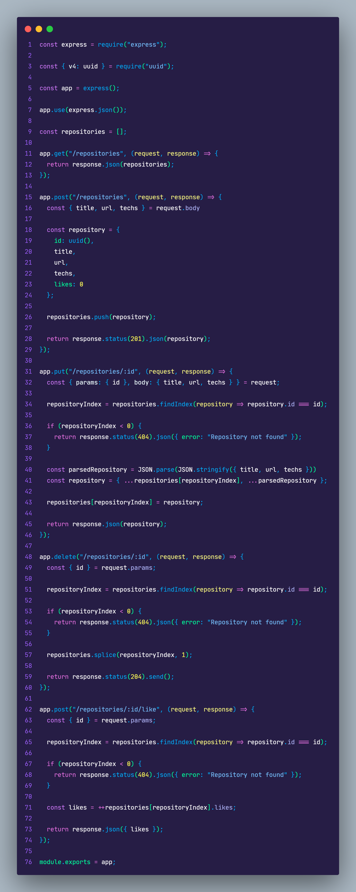
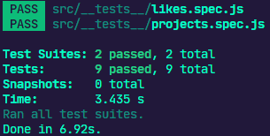

# Desafio 03: Corrigindo o Código


<h3 align="center">
  Desafio 03: Corrigindo o Código
</h3>
<p align="center">
  

  <a href="https://app.rocketseat.com.br/me/matheus-marins">
    
  </a>

 <a href="https://github.com/rocketseat-education/ignite-template-corrigindo-o-codigo/stargazers">
    
  </a>
</p>

---

# :rocket: Sobre o desafio

Nesse desafio, corrigi uma aplicação Node.js que está em processo de desenvolvimento mas que já possuia os testes necessários para fazer toda a validação dos requisitos.

Foram feitas algumas alterações no código da aplicação propositalmente, com isso parte dos testes deixaram de passar e agora só você pode resolver esse problema. Bora lá? 🚀

Essa aplicação realiza o CRUD (**C**reate, **R**ead, **U**pdate, **D**elete) de repositórios de projetos. Além disso, é possível dar likes em repositórios cadastrados, aumentando a quantidade de likes em 1 a cada vez que a rota é chamada.

 ### **Para saber tudo sobre o desafio acesse [NotionDesafio](https://www.notion.so/Desafio-03-Corrigindo-o-c-digo-c15c8a2e212846039a367cc7b763c6dd).**
 
---
### :keyboard: Instalação e Execução do Projeto

- Clone este repositório

```
> git clone https://github.com/Mar0la/ignite-corrigindo-o-codigo
```

- Navegue até o diretório principal do projeto

```
> cd ignite-corrigindo-o-codigo
```

- Instale as dependências com o Yarn

```
yarn
```

- Rode a suite de testes

```
yarn test
```

- Execute o projeto

```
yarn dev
```
---
### **Resolução do Desafio**
  


### **Retorno que devemos ter ao digitar  <code>yarn test</code>** no terminal
  

---
## FeedBack do Desafio
  - Bom não vou mentir, tive que refazer pelo menos umas 2 vezes pra realmente entender toda a proposta do desafio, devo que esse foi o desafio que achei mais interessante ate agora.
---


